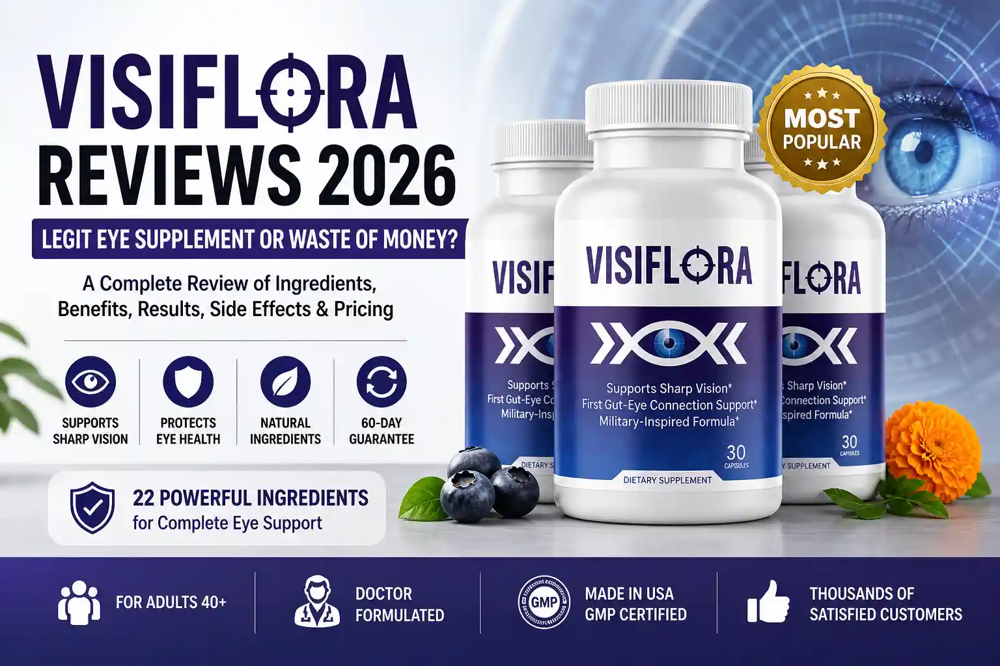
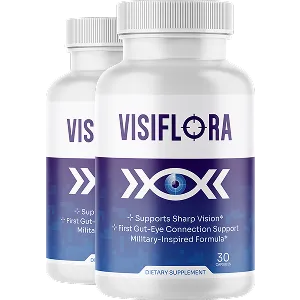

# VisiFlora Reviews 2026 – Legit Eye Supplement or Waste of Money?

  

## 👉 [🔥 Visit Official VisiFlora Website](https://tryvisiflora.com/welcome/?aff_id=451&subid=h)

---

> ✅ Supports sharp vision & macular health
> 👁️ Helps reduce screen fatigue
> ⚠️ Results build gradually (not instant)

---

VisiFlora reviews are getting steady attention as more adults search for a reliable daily eye supplement that goes beyond basic lutein pills. With growing screen time, UV exposure, and age-related changes affecting millions of Americans over 40, the demand for a comprehensive vision support formula has never been higher.

This VisiFlora review takes a close look at the 22-ingredient formula, the science behind the gut-eye connection, real customer feedback, and whether VisiFlora is worth adding to your daily routine in 2026.

  

---

## 👉 [🔥 Visit Official VisiFlora Website](https://tryvisiflora.com/welcome/?aff_id=451&subid=h)

---

## Table of Contents

* Quick Summary Table
* What Is VisiFlora?
* How Does VisiFlora Work?
* VisiFlora Ingredients and Formula Review
* What Benefits Does VisiFlora Offer?
* VisiFlora Reviews and Results From Real Users
* VisiFlora Pros and Cons
* Are There Any Side Effects?
* Is VisiFlora Legit or a Scam?
* VisiFlora Pricing and Purchase Options
* VisiFlora Free Bonuses
* 60-Day Money-Back Guarantee
* Final Conclusion
* Frequently Asked Questions

---

## Quick Summary Table

| Attribute         | Details                                                                                  |
| ----------------- | ---------------------------------------------------------------------------------------- |
| Product           | [VisiFlora](https://visiflora-vision.com/)                                               |
| Type              | Dietary supplement for daily eye health and vision support                               |
| Form              | Capsules (once daily)                                                                    |
| Total Ingredients | 22 vitamins, minerals, antioxidants, and botanical extracts                              |
| Key Ingredients   | Lutein, Zeaxanthin, Bilberry Extract, Astaxanthin, Vitamin A, Ginkgo Biloba              |
| Reported Support  | Macular wellness, blue light filtering, night vision, eye strain relief                  |
| Unique Approach   | Gut-eye axis connection for improved nutrient absorption                                 |
| Good For          | Adults 40+ experiencing screen fatigue, age-related vision changes, or light sensitivity |
| Not For           | Children, pregnant or nursing individuals, or anyone with known ingredient sensitivities |
| Manufacturing     | Made in USA, FDA-registered facility, GMP-certified                                      |
| Guarantee         | 60-day, 100% money-back guarantee when ordered from the official website                 |
| Official Website  | [Click Here](https://visiflora-vision.com/)                                              |

---

## What Is VisiFlora?

  

VisiFlora is a 22-ingredient daily eye supplement designed to support clear vision, macular health, and long-term eye comfort through a dual approach: delivering targeted nutrients directly to the retina and macula, while also supporting gut health as a pathway to better nutrient absorption.

Unlike basic eye vitamins that contain only lutein and zeaxanthin, VisiFlora combines a broader spectrum of antioxidants, botanical extracts, and gut-supportive compounds into a single daily capsule.

Many VisiFlora supplement reviews highlight the convenience of the one-capsule-per-day format and the fact that it does not require multiple pills or complicated timing around meals.

According to the American Academy of Ophthalmology, over 24.4 million Americans aged 40 and older are affected by age-related eye conditions. Research published in JAMA Ophthalmology shows that adults over 40 experience a steady decline in macular pigment density, contrast sensitivity, and overall visual sharpness.

VisiFlora was developed to address these concerns through comprehensive daily nutritional support rather than single-ingredient approaches.

## 👉 [🔥 Buy VisiFlora Now](https://tryvisiflora.com/welcome/?aff_id=451&subid=h)

  

---

## How Does VisiFlora Work?

Many people reading VisiFlora reviews want to understand the mechanism before committing. VisiFlora works through a multi-layer approach rather than relying on a single ingredient pathway.

### Supports Macular Pigment Density

VisiFlora delivers lutein and zeaxanthin, two carotenoids that concentrate in the macula to support sharp central vision. These pigments act as natural blue light filters and help protect retinal cells from oxidative damage caused by screens, sunlight, and environmental stress.

### Targets the Gut-Eye Connection

One of the most distinctive aspects of the VisiFlora formula is its focus on the gut-eye axis. Recent studies from institutions including University College London and NIH-indexed journals have examined how intestinal health may influence eye conditions through inflammatory pathways.

VisiFlora includes gut-supportive ingredients like Grape Seed Extract, Quercetin, and Rutin to help reinforce gut lining integrity, which may support better absorption and delivery of eye-specific nutrients.

### Provides Multi-Layer Antioxidant Protection

The formula includes a Vision Defense Matrix with antioxidants like Vitamin C, Vitamin E, and Alpha-Lipoic Acid. These work together to help neutralize free radicals that can damage delicate eye tissue over time.

### Supports Healthy Eye Circulation

Ingredients such as Ginkgo Biloba and Bilberry Extract support healthy blood flow to the eyes, helping deliver oxygen and nutrients to the retina and optic nerve more efficiently.

### Designed for Gradual, Daily Results

VisiFlora is formulated for consistent daily use. Most VisiFlora reviews report that noticeable benefits appear after 4-6 weeks of regular use, with more pronounced results at the 60-90 day mark.

## 👉 [🔥 Buy VisiFlora Now](https://tryvisiflora.com/welcome/?aff_id=451&subid=h)

---

## VisiFlora Ingredients and Formula Review

  

A clear VisiFlora ingredients breakdown helps explain why user experiences tend to focus on gradual improvements rather than instant changes. The formula is organized into four functional groups.

👉 [VisiFlora Ingredients](https://visiflora-vision.com/ingredients.html)

---

## 👉 [🔥 Buy VisiFlora Now](https://tryvisiflora.com/welcome/?aff_id=451&subid=h)

---

## What Benefits Does VisiFlora Offer?

Based on VisiFlora's latest reviews, users commonly report benefits that build with consistent daily use rather than instant changes.

Supports Clear, Sharp Central Vision
Helps Reduce Digital Eye Strain
Supports Night Vision and Low-Light Comfort
Provides Daily Antioxidant Protection
Supports Long-Term Macular Wellness
Enhances Nutrient Absorption Through Gut Support

## 👉 [🔥 Buy VisiFlora Now](https://tryvisiflora.com/welcome/?aff_id=451&subid=h)

---

## VisiFlora Reviews and Results From Real Users

👉 [Real Reviews](https://visiflora-vision.com/index.html#reviews)

When reading through VisiFlora real reviews, a consistent pattern emerges. Most users describe gradual improvements that build with daily use rather than sudden or dramatic changes.

Sandra M. – Florida, USA
"I spend about 8 hours a day on my computer for work..."

Robert K. – Ohio, USA
"Night driving had become uncomfortable..."

Patricia W. – Arizona, USA
"I tried three different eye supplements..."

James T. – Texas, USA
"I was skeptical about another supplement..."

## 👉 [🔥 Buy VisiFlora Now](https://tryvisiflora.com/welcome/?aff_id=451&subid=h)

  

---

## VisiFlora Pros and Cons

  

### Pros

* 22-ingredient formula
* Gut-eye support
* Clinically studied ingredients
* Easy daily use

### Cons

* Requires consistent use
* Not instant

---

## Are There Any Side Effects?

Most VisiFlora reviews indicate no major side effects when used as directed.

---

## Is VisiFlora Legit or a Scam?

👉 [About VisiFlora](https://visiflora-vision.com/about.html)

---

## 👉 [🔥 Buy From Official Website](https://tryvisiflora.com/welcome/?aff_id=451&subid=h)

---

## VisiFlora Pricing and Purchase Options

  

1 Bottle – $69
3 Bottles – $59
6 Bottles – $49

---

## 👉 [🔥 Check Latest Price](https://tryvisiflora.com/welcome/?aff_id=451&subid=h)

---

## VisiFlora Free Bonuses With Your Order

Bonus #1 – Military Vision Protection Manual
Bonus #2 – 7-Day Gut Reset Plan
Bonus #3 – 48-Hour Vision Jump-Start Guide

---

## VisiFlora 60-Day Money-Back Guarantee

60-day 100% money-back guarantee included.

---

## Final Conclusion and Expert Review

VisiFlora stands out as one of the more comprehensive eye health supplements available in 2026.

👉 [🔥 Buy Now](https://tryvisiflora.com/welcome/?aff_id=451&subid=h)

  

---

## Frequently Asked Questions About VisiFlora

### How do I take VisiFlora?

Take one capsule daily with water, preferably with a meal for better absorption. Consistency is important for best results.

---

### Is VisiFlora safe for daily use?

Based on its ingredient profile, VisiFlora is generally safe for daily use when taken as directed. However, consult your healthcare provider if you are on medication.

---

### Does VisiFlora really work?

Many users report gradual improvements in eye comfort, reduced screen strain, and better clarity after 4–8 weeks of consistent use.

---

### How long does it take to see results?

Most users notice early improvements within 2–4 weeks, with stronger results after 6–8 weeks.

---

### Where should I buy VisiFlora?

VisiFlora is available only through the official website:
👉 https://tryvisiflora.com/welcome/?aff_id=451&subid=h

## References

American Academy of Ophthalmology
AREDS2 Study
Gut-Eye Axis Research

---

## Disclaimer

This article contains affiliate links. Results may vary.
